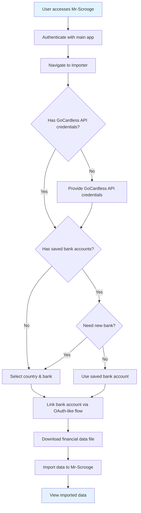
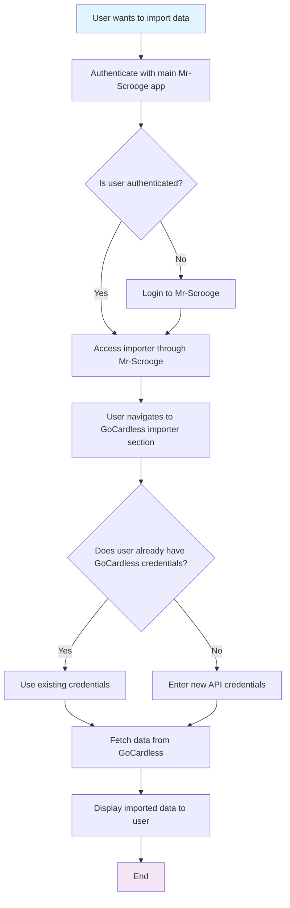
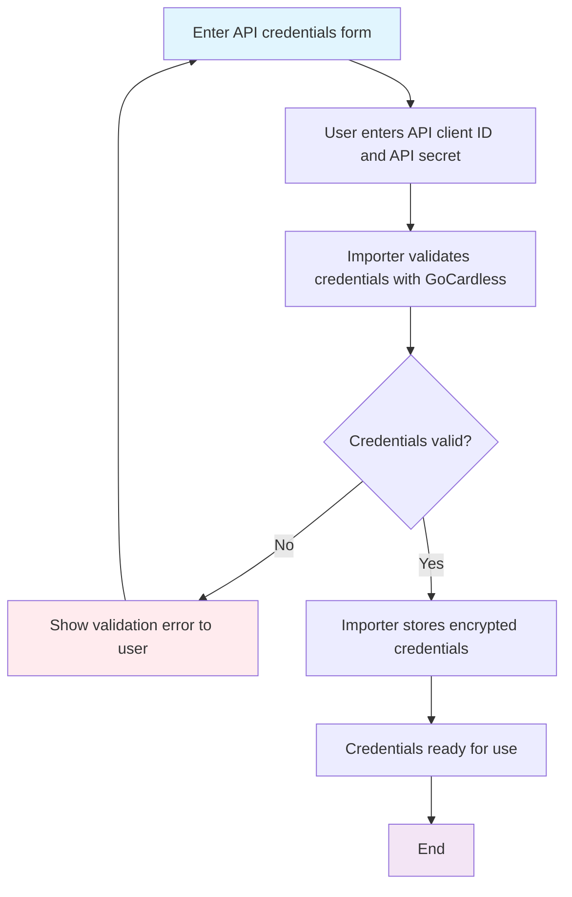

# GoCardless Importer Documentation

## Overview Flow



## System Architecture

Mr-Scrooge consists of two separate applications:
- Main Mr-Scrooge application: Where users authenticate and manage their accounts
- Importer application: Where users import financial data from external sources like GoCardless

Authentication happens through the main Mr-Scrooge app's OAuth system, and users access the importer through the main application.

## Authentication Approach

Since GoCardless does not support OAuth for this feature, users will need to provide their API client ID and API secret directly in the importer application. This approach allows direct API access without the OAuth flow.

## API Credentials Flow Diagrams

### Main Authentication Flow



### New Credentials Flow



### Data Import Flow

```mermaid
flowchart TD
    A[Start data import] --> B{Has GoCardless API credentials?}
    B -->|Yes| C[Use stored credentials to access GoCardless API]
    B -->|No| D[Request user to provide API credentials]
    D --> E[Validate and store API credentials]
    E --> C
    C --> F[Check for saved bank accounts]
    F --> G{Does user have saved bank accounts?}
    G -->|Yes| H{Does user want to use saved bank account?}
    G -->|No| I[Request user to specify country]
    H -->|Yes| J[Display saved bank accounts as options]
    H -->|No| I
    I --> K[Query GoCardless for available banks in specified country]
    J --> L[User selects from saved bank accounts]
    K --> M[Display available banks to user]
    M --> N[User selects a bank]
    L --> O[Use saved bank account details]
    N --> P[Retrieve account information from selected bank]
    O --> Q[Build link to bank account]
    P --> R[Display available accounts to user]
    R --> S[Always save bank account details and link]
    S --> T[Build link to bank account]
    O --> T
    T --> U[Initiate bank account linking flow]
    U --> V[Redirect user to bank for authentication and consent]
    V --> W[User authenticates and consents to data access]
    W --> X[Bank redirects user back to importer with authorization]
    X --> Y[Complete bank account linking process]
    Y --> Z[Save link information to database]
    Z --> AA[Access linked bank account]
    AA --> BB[Download financial data file from bank]
    BB --> CC[Process downloaded file in importer]
    CC --> DD[Importer sends data to main Mr-Scrooge app]
    DD --> EE[Main app processes and stores data]
    EE --> FF[Display imported data to user]
    FF --> GG[End]

    style A fill:#e1f5fe
    style GG fill:#f3e5f5
```



## Sequence Diagram

```mermaid
sequenceDiagram
    participant U as User
    participant MS as Main Mr-Scrooge App
    participant IMP as Importer App
    participant GC as GoCardless

    U->>+MS: Access Mr-Scrooge application
    alt User not authenticated
        MS->>U: Redirect to login
        U->>MS: Login credentials
        MS->>U: Authenticate and establish session
    end
    U->>+IMP: Navigate to GoCardless importer
    IMP->>MS: Verify user authentication
    MS-->>-IMP: Confirm authenticated user
    IMP->>U: Load API credentials form
    IMP->>MS: Check if user has stored GoCardless API credentials
    MS-->>-IMP: Return credentials or none
    alt User has stored credentials
        IMP->>IMP: Use stored credentials to access GoCardless API
    else User has no stored credentials
        IMP->>U: Request user to provide API credentials
        U->>IMP: Provide API credentials
        IMP->>+GC: Validate credentials
        GC-->>-IMP: Validation response
        alt Credentials invalid
            IMP->>U: Show validation error
            U->>IMP: Correct credentials
            IMP->>+GC: Re-validate credentials
            GC-->>-IMP: Validation response
        end
        IMP->>IMP: Store encrypted credentials
    end
    IMP->>MS: Check for saved bank accounts for user
    MS-->>-IMP: Return saved bank accounts or none
    alt Saved bank accounts exist
        IMP->>U: Ask if user wants to use saved bank account
        U->>IMP: Respond whether to use saved bank account
        alt User wants to use saved bank account
            IMP->>U: Display saved bank accounts as options
            U->>IMP: Select from saved bank accounts
            IMP->>IMP: Use saved bank account details
        else User wants new bank
            IMP->>U: Request user to specify country
            U->>IMP: Specify country
            IMP->>+GC: Query for available banks in specified country
            GC-->>-IMP: Return list of available banks
            IMP->>U: Display available banks
            U->>IMP: Select a bank
        end
    else No saved bank accounts
        IMP->>U: Request user to specify country
        U->>IMP: Specify country
        IMP->>+GC: Query for available banks in specified country
        GC-->>-IMP: Return list of available banks
        IMP->>U: Display available banks
        U->>IMP: Select a bank
    end
    IMP->>+GC: Request account information for selected bank
    GC-->>-IMP: Return account details
    IMP->>U: Display account options
    U->>IMP: Select accounts to import
    IMP->>IMP: Always save bank account details and link information
    IMP->>IMP: Build link to bank account
    IMP->>U: Initiate bank account linking flow (similar to OAuth)
    U->>+GC: Redirect to bank for authentication and consent
    GC->>U: User authenticates and consents to data access
    U->>IMP: Bank redirects user back to importer with authorization
    IMP->>IMP: Complete bank account linking process
    IMP->>MS: Save link information to database
    IMP->>+GC: Access linked bank account
    GC-->>-IMP: Confirm access authorization
    IMP->>+GC: Download financial data file from bank
    GC-->>-IMP: Return financial data file
    IMP->>IMP: Process downloaded file in importer
    IMP->>+MS: Send imported data
    MS->>MS: Process and store data
    MS-->>U: Display imported data
    U-->>MS: End session
```

## API Credentials Flow

The GoCardless importer uses API credentials (client ID and secret) to securely connect user accounts and import financial data. Here's how the process works:

### 1. Application Registration
- User registers their application with GoCardless to obtain API credentials (Client ID and API Secret)
- Store these credentials securely for use with the Mr-Scrooge importer

### 2. User Authentication
- User authenticates with the main Mr-Scrooge application first
- The main application verifies user identity and establishes a session
- User navigates to the importer section through the main application

### 3. API Credentials Entry
- User accesses the GoCardless importer section
- Importer application presents a form for API credentials
- User enters their GoCardless API Client ID and API Secret

### 4. Credential Check
- Importer checks if user has previously stored GoCardless API credentials
- If credentials exist, skips credential entry and proceeds to bank selection
- If no credentials exist, prompts user to enter API credentials

### 5. Credential Validation (when needed)
- When user provides new credentials, importer sends them to GoCardless for validation
- GoCardless confirms the validity of the credentials
- Importer application stores encrypted credentials for future use

### 6. Country Selection
- Importer requests user to specify the country (if not using saved bank account)
- User provides the country for which they want to see available banks

### 7. Saved Bank Accounts Check
- Importer checks if user has previously saved bank accounts
- If saved bank accounts exist, offers them as quick selection options
- User can select from saved bank accounts or choose to browse new banks

### 8. Bank Selection
- If user chooses to browse new banks, importer queries GoCardless for available banks in the specified country
- Displays the list of available banks to the user
- User selects a bank from the list

### 9. Account Information Retrieval
- Importer retrieves account information from the selected bank
- Displays account options to the user
- User selects which accounts to import data from

### 10. Bank Account Saving
- Importer always saves the selected bank account details for future use
- The bank account record includes the link information required for access
- Bank account details are stored securely in the database

### 11. Bank Account Linking
- Importer builds a link to the selected bank account using the required data
- Initiates a bank account linking flow similar to OAuth
- Redirects user to the bank's website/app for authentication and consent
- User authenticates with their bank and consents to data access
- Bank redirects user back to the importer with authorization
- Importer completes the bank account linking process
- Link information is saved to the database for future access

### 12. File Download
- Importer accesses the linked bank account using the authorization
- Downloads the financial data file from the bank
- Processes the downloaded file in the importer application

### 13. Data Import
- Importer application forwards processed data to the main Mr-Scrooge application
- Main application processes and stores the imported data
- Main application displays the imported data to the user

### Security Considerations
- Store API credentials securely using strong encryption
- Never log or expose API credentials in plain text
- Implement secure credential validation without storing invalid credentials
- Follow security best practices for handling sensitive API keys
- Regularly rotate API credentials when possible
- Protect user bank selection and account information with appropriate access controls
- Encrypt sensitive banking data during transmission and storage
- Securely store saved bank account information with appropriate encryption
- Implement access controls to ensure users can only access their own saved bank accounts
- Secure the bank account linking process with appropriate authentication and authorization
- Protect the redirect URLs and authorization tokens used in the linking flow
- Validate and sanitize all data passed during the bank account linking process
- Secure file downloads and processing with appropriate validation and sanitization
- Protect against malicious files during the download and import process
- Implement proper file type validation and security scanning for downloaded files
- Securely store bank account details and link information in the database with appropriate encryption
- Protect sensitive link information and authorization tokens stored in the database

### Error Handling
- Handle invalid credentials gracefully with clear user feedback
- Manage API rate limiting from GoCardless
- Provide clear feedback to users during credential validation failures
- Securely handle credential storage failures
- Handle country selection errors and invalid country codes
- Handle bank selection errors and unavailable banks appropriately
- Manage account retrieval failures with informative error messages
- Handle country-specific bank selection issues
- Handle errors related to saving and retrieving saved bank accounts
- Manage access errors when users try to access saved bank accounts that don't belong to them
- Handle errors during the bank account linking flow (redirect failures, authentication issues)
- Manage authorization failures when users deny consent at the bank
- Handle timeouts or failures during the bank account linking process
- Handle file download errors and corrupted files
- Manage file processing failures and incompatible file formats
- Handle security validation failures for downloaded files